## Part 1. Готовый докер

Взять официальный докер образ с **nginx** и выкачать его при помощи `docker pull`

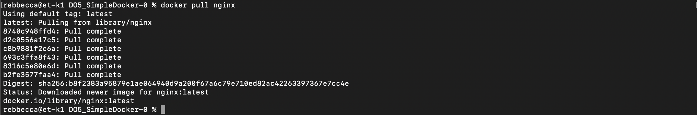

##### Проверить наличие докер образа через `docker images`

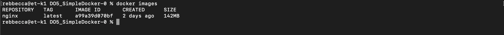

##### Запустить докер образ через `docker run -d [image_id|repository]`

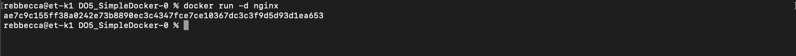

##### Проверить, что образ запустился через `docker ps`

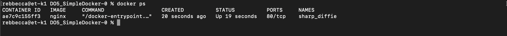

##### Посмотреть информацию о контейнере через `docker inspect [container_id|container_name]`

- Размер контейнера:

 141532686 байт (142 MB)

- Список замапленных портов: 

80 в null

- ip контейнера: 

172.17.0.2

##### Остановить докер образ через `docker stop [container_id|container_name]`

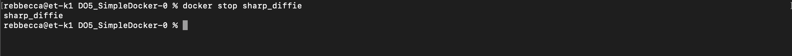

##### Проверить, что образ остановился через `docker ps`

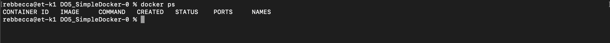

##### Запустить докер с замапленными портами 80 и 443 на локальную машину через команду *run*

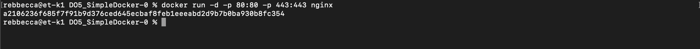

##### Проверить, что в браузере по адресу *localhost:80* доступна стартовая страница **nginx**

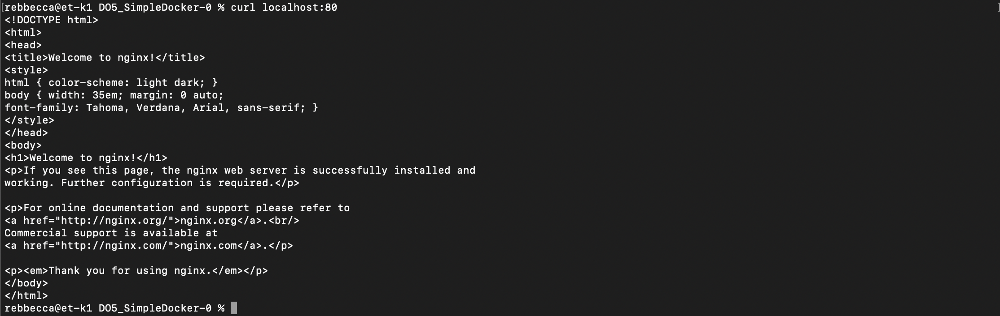

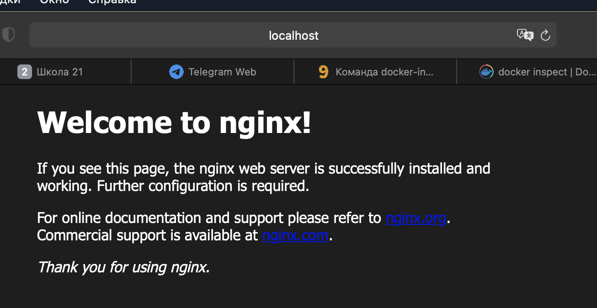

##### Перезапустить докер контейнер через `docker restart [container_id|container_name]`

##### Проверить любым способом, что контейнер запустился

## Part 2. Операции с контейнером

##### Прочитать конфигурационный файл *nginx.conf* внутри докер контейнера через команду *exec*

docker exec -i -t a2106236f685 /bin/sh
cat /etc/nginx/nginx.conf 

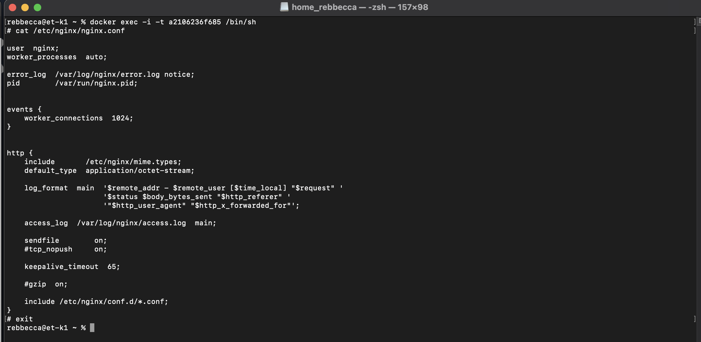

##### Создать на локальной машине файл *nginx.conf*

создаем файл *nginx.conf*

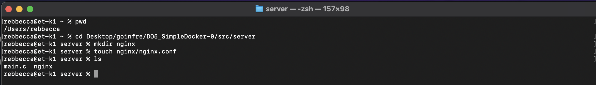

##### Настроить в нем по пути */status* отдачу страницы статуса сервера **nginx**

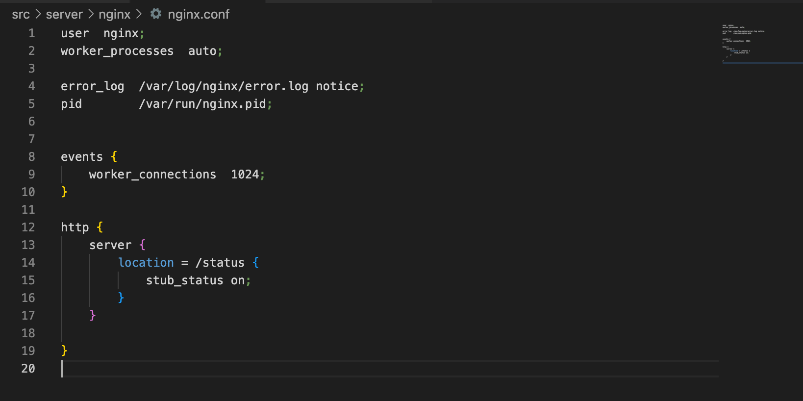

##### Скопировать созданный файл *nginx.conf* внутрь докер образа через команду `docker cp`
######CONTAINER ID = a2106236f685

docker cp nginx.conf a2106236f685:/etc/nginx/nginx.conf

##### Перезапустить **nginx** внутри докер образа через команду *exec*
######CONTAINER ID = a2106236f685

docker exec -i -t a2106236f685 nginx -s reload

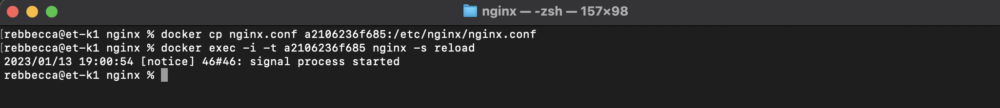

##### Проверить, что по адресу *localhost:80/status* отдается страничка со статусом сервера **nginx**

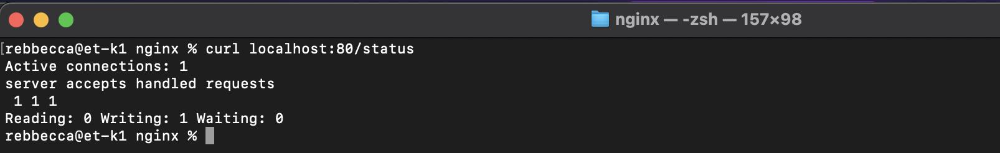

##### Экспортировать контейнер в файл *container.tar* через команду *export*

######CONTAINER ID = a2106236f685
команда docker export a2106236f685 > container.tar 

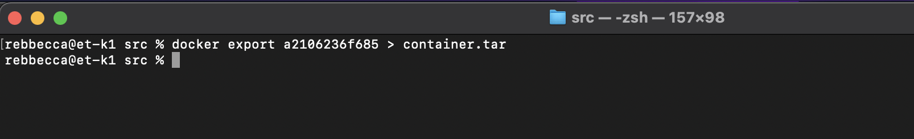

##### Остановить контейнер

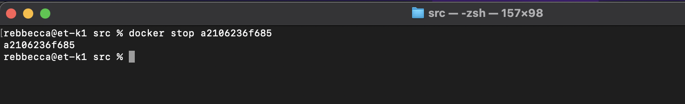

##### Удалить образ через `docker rmi [image_id|repository]`, не удаляя перед этим контейнеры
##### Удалить остановленный контейнер

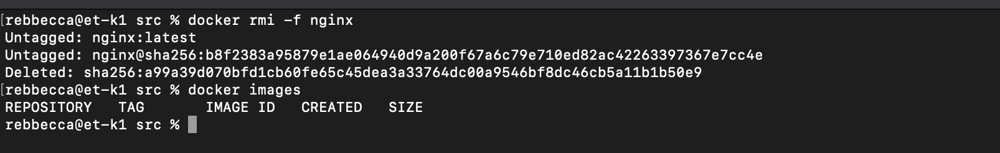

##### Импортировать контейнер обратно через команду *import*

команда: docker import container.tar rebbecca

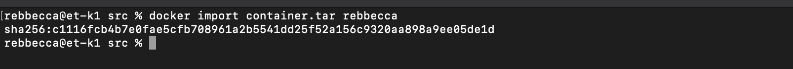

##### Запустить импортированный контейнер

команда: docker run -d -p 80:80 -p 443:443 rebbecca /docker-entrypoint.sh nginx -g "daemon off;"

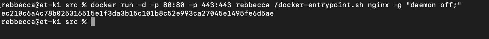

##### Проверить, что по адресу *localhost:80/status* отдается страничка со статусом сервера **nginx**

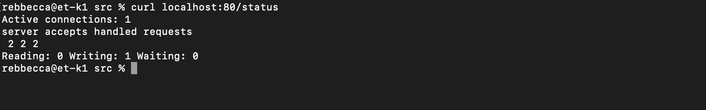
